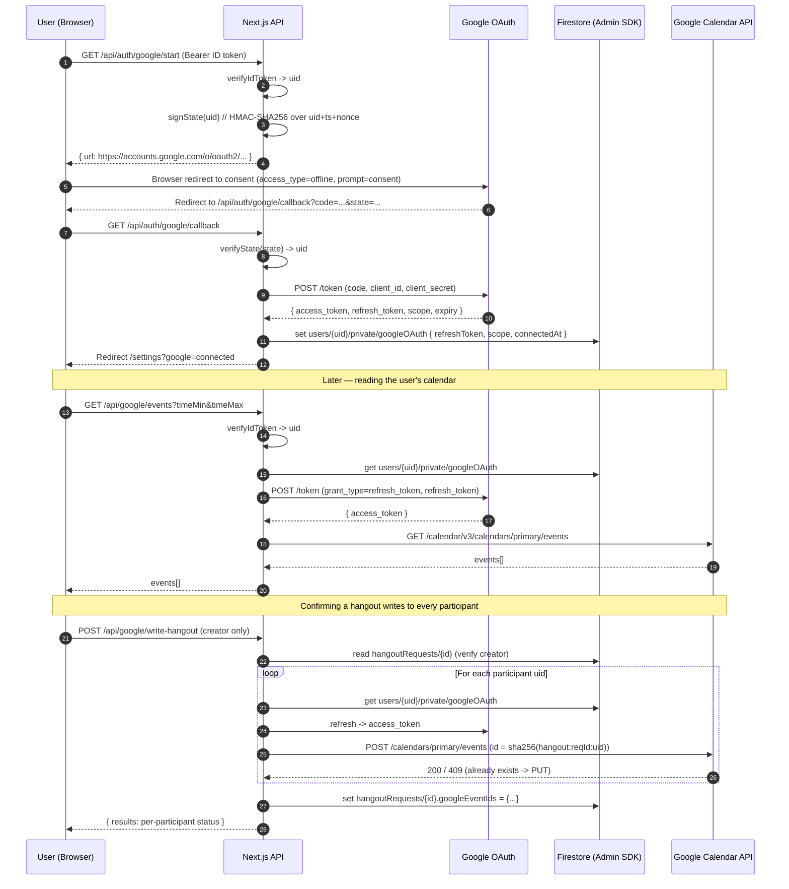

# Architecture

Hangly is a Next.js 15 app that bridges Google Calendar and Chouseisan-style group scheduling. Users sign in with Firebase Auth, connect Google Calendar via a separate OAuth flow, create hangout requests, collect availability from participants, and confirm a slot that is written back to every participant's Google Calendar.

## System overview

```
                          ┌──────────────────────────────┐
                          │      Browser (Next.js)       │
                          │  - React 19 / TanStack Query │
                          │  - Firebase JS SDK (Auth)    │
                          │  - Direct GCal API for reads │
                          └────────────┬─────────────────┘
                                       │
                                       │ (Firebase ID token in Authorization header)
                                       │
              ┌────────────────────────┼────────────────────────────┐
              │                        │                            │
              ▼                        ▼                            ▼
  ┌───────────────────────┐  ┌──────────────────────┐   ┌──────────────────────┐
  │   /api/auth/google/*  │  │   /api/google/*      │   │ /api/hangouts/...    │
  │   start, callback     │  │   status, events,    │   │ rank-slots           │
  │                       │  │   probe, write-      │   │  (Claude Haiku 4.5)  │
  │   (OAuth2 code flow)  │  │   hangout, disconnect│   │                      │
  └──────────┬────────────┘  └──────────┬───────────┘   └──────────┬───────────┘
             │                          │                          │
             │       (Admin SDK)        │   (mint short-lived      │
             ▼                          ▼    access tokens)        ▼
  ┌──────────────────────────────────────────────┐      ┌─────────────────────┐
  │              Firestore                       │      │   Google Calendar   │
  │  users/{uid}/calendarItems                   │      │   API v3            │
  │  users/{uid}/private/googleOAuth (server)    │      │                     │
  │  hangoutRequests/{requestId}                 │      │                     │
  │  userNotifications/{uid}/notifications       │      │                     │
  └──────────────────────────────────────────────┘      └─────────────────────┘
```

The browser handles authentication directly with Firebase Auth (no session cookies). Every authenticated request to our API routes carries a fresh Firebase ID token in the `Authorization: Bearer` header, which the server verifies using the Admin SDK before doing anything privileged.

## OAuth + token flow

This is the trickiest part of the design. Firebase Auth's `GoogleAuthProvider` cannot return a refresh token (it uses the implicit grant), so for Calendar API access we run a **second, independent** OAuth 2.0 authorization-code flow.



### Token security boundary

The refresh token never crosses the server/client boundary. It lives at `users/{uid}/private/googleOAuth` with a Firestore security rule that denies all client reads and writes (`allow read, write: if false`) — only the Admin SDK can touch it. Short-lived access tokens are minted on demand server-side and used immediately; they're never persisted.

## Data model

| Collection | Path | Owner | Purpose |
|---|---|---|---|
| Calendar items | `users/{uid}/calendarItems/{id}` | per-user | Manual events + recurring "stamp" definitions |
| Google OAuth | `users/{uid}/private/googleOAuth` | server-only | Refresh token + scope + last error |
| Hangout requests | `hangoutRequests/{id}` | creator | Date/time ranges, participants, common slots, confirmed slot, GCal write status |
| Notifications | `userNotifications/{uid}/notifications/{id}` | per-user | In-app invitations after hangout confirms |

Date fields are stored as Firestore `Timestamp` and converted to JS `Date` at the read boundary (`src/lib/firebase/firestoreService.ts`). Zod schemas (`src/lib/firebase/schemas.ts`) validate the client-side shapes so a malformed document fails at the data boundary instead of deep in a component.

## Module boundaries

- **`src/app/`** — routes (App Router). Pages are thin orchestrators; logic lives elsewhere.
- **`src/app/api/`** — Route Handlers running on the Node.js or Edge runtime. All Google API and Admin SDK code lives here.
- **`src/components/`** — UI by domain (`calendar/`, `hangouts/`, `google/`, `ui/`, `common/`).
- **`src/hooks/`** — view-state hooks (`useCalendarView`, `useCalendarStore`).
- **`src/lib/queries/`** — TanStack Query wrappers around server actions.
- **`src/lib/google/`** — OAuth, token storage, idempotent event IDs, write-back client.
- **`src/lib/firebase/`** — client config, server-only `admin.ts` (Admin SDK), Zod schemas, `firestoreService.ts` (per-collection CRUD).
- **`src/utils/`** — pure business logic (`expandRecurringEvents`, `findCommonAvailability`). Tested with Vitest.

## Observability

- `instrumentation.ts` wires Sentry server/edge configs at runtime. If `SENTRY_DSN` is unset, every Sentry call is a no-op — safe to ship without setup.
- `src/components/common/WebVitalsReporter.tsx` uses `next/web-vitals` to report Core Web Vitals (LCP, INP, CLS, etc.) to `/api/vitals`.
- `/api/vitals` runs on the Edge runtime; in production swap the console logger for Sentry/Datadog/etc.

## Testing

| Layer | Approach |
|---|---|
| Pure business logic | Vitest (`src/utils/__tests__/`) — 17 tests covering recurring expansion + slot finding |
| Schema validation | Vitest (`src/lib/firebase/__tests__/schemas.test.ts`) — Zod round-trips |
| Accessibility | `jest-axe` against rendered components (`src/components/calendar/__tests__/*.a11y.test.tsx`) |
| Integration / E2E | Not yet — Playwright is the natural next step |

Run `npm test` for the suite, `npm run lint` for ESLint, `npm run build` for type-check + Next build.

## Decisions

See `docs/decisions/` for ADRs covering the most load-bearing choices.
